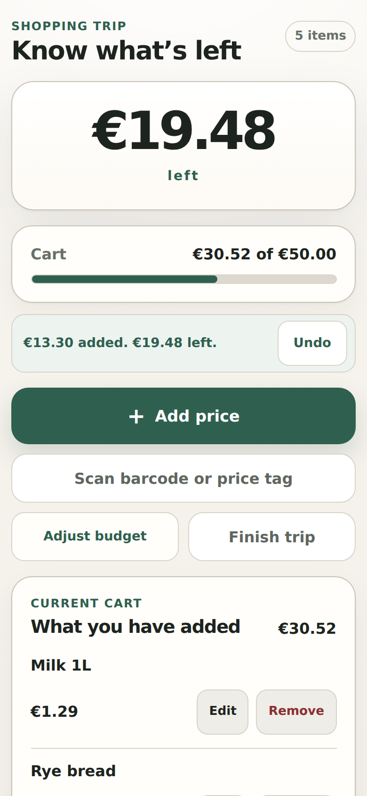

# Shopping Budget Companion

**Know what’s left before checkout.** Set a spending limit, add prices as you shop and always see what you can still spend — while the cart can still change.

[](https://github.com/MykolaDotsenko/shopping-budget-companion/actions/workflows/quality.yml)
[](https://react.dev/)
[](https://www.typescriptlang.org/)

**[Open the app](https://mykoladotsenko.github.io/shopping-budget-companion/)** · [Privacy](https://mykoladotsenko.github.io/shopping-budget-companion/privacy/) · [Send feedback](https://github.com/MykolaDotsenko/shopping-budget-companion/issues/new?template=feedback.yml)

<p align="center">
  
</p>

---

## What it does

- **Start in one tap:** pick €25, €50, €75 or €100, or type your own limit, with an optional safety buffer for weighed items and deposits.
- **Add prices fast:** a price is enough; a name is optional. You see what’s left before you add, and a clear warning before going over.
- **Fix mistakes easily:** edit, remove and undo; change the budget mid-trip.
- **Finish and compare:** finish the trip, add the receipt total and see how close you were.
- **Shop again with less typing:** reuse your last budget, and remembered prices from past trips — always with an explicit way to enter today’s price.
- **Use the camera if you like:** scan a barcode to recall a product and its last price, or read a shelf price tag; the camera picture never leaves the phone.
- **Private and offline:** no account and no bank connection; everything stays on your device, and the app works offline once opened. Install it to keep it on your home screen; the app offers this on the start screen where the browser allows it, and on iPhone it explains Add to Home Screen before your first trip.

This is deliberately narrower than a generic expense tracker:

**set a spending limit → add prices quickly → always know what remains**

---

## Engineering highlights

- **Exact money:** canonical financial state uses integer minor units, never binary floating point.
- **Pure domain rules:** totals, remaining budget, safety buffer, projections, over-budget state, product codes and shelf-price candidates live outside React.
- **Local-first durability:** versioned Zod-validated persistence with explicit degraded-write and recovery states.
- **Loss-safe completion:** history and active-trip cleanup are reconciliation-aware.
- **Independent advisory data:** Price Memory and barcode names cannot corrupt active-trip or history durability.
- **Proportional state architecture:** a plain TypeScript `ShoppingAppController` + `useSyncExternalStore`; no Redux, Zustand, XState, router or backend.
- **On-device camera features:** barcode reading (native `BarcodeDetector`, self-hosted ZXing WASM fallback) and price-tag reading (self-hosted Tesseract.js) load lazily, keep camera frames on the device and can each be switched off per build.
- **Installable offline shell:** Workbox precaches only application assets; the scanner and OCR engines are cached on first use, shopping state stays in `localStorage` and updates are user-controlled.
- **Evidence separation:** guarded evidence builds never become product state and never enter the public bundle.

## Architecture

```text
features ─────────▶ application ─────────▶ domain
                         ▲                    ▲
        implements ports │                    │ uses
                         └── infrastructure ──┘

composition root (src/app/composition-root.ts): wires the infrastructure adapters into the application
```

| Layer | Owns |
| --- | --- |
| **Domain** | money, trip invariants, projections, selectors, product codes, barcode links, shelf-price candidates |
| **Application** | public contracts, ports, lifecycle, use cases, Undo, persistence ordering, recovery |
| **Infrastructure** | storage transactions, codecs/schemas, camera, barcode and price-OCR engines, product lookup, runtime boundaries |
| **UI** | rendering, drafts, focus, accessibility, interaction feedback |
| **QA** | guarded evidence builds only |

ESLint enforces the layer boundaries. See [Architecture](./docs/ARCHITECTURE.md).

---

## Tech stack

**Runtime:** React 19.3, TypeScript 6 strict, Vite 8, Zod 4 (`zod/mini`), CSS Modules, native Web APIs, versioned `localStorage`, Workbox-generated PWA shell (`vite-plugin-pwa`), `barcode-detector` + `zxing-wasm` for the barcode fallback, Tesseract.js 7 with Finnish language data for price tags.

**Quality:** ESLint 10, Vitest 5, React Testing Library, user-event, fast-check, Playwright, axe-core, GitHub Actions, CodeQL, Dependency Review, CycloneDX SBOM and build-provenance attestations.

Runtime dependencies must earn their product value; see [Tech stack](./docs/reference/TECH-STACK.md).

---

## Quality gates

```bash
npm ci
npm run check
npm run test:e2e
```

`npm run check` validates the documentation, lints, type-checks, runs the unit and component tests with coverage thresholds, builds the app and validates the public build. `npm run test:e2e` runs the public browser suite against a fresh production build.

CI tests the exact artifact it deploys: Chromium, Firefox and WebKit journeys with axe accessibility checks, the guarded evidence builds against their own surfaces, a build with the camera features switched off, a production dependency audit, an SBOM and provenance attestations. Deployment waits for every job. The full contract is in [Testing](./docs/TESTING.md).

---

## Evidence status

Barcode scanning (D-053) and price-tag reading (D-055) shipped ahead of their physical evidence and can each be switched off per build. Still open:

- ⏳ exact quantitative manual-entry timing baseline (physical-phone usability was accepted by owner attestation on 2026-09-24, but no timing JSON was retained)
- ⏳ 20–50 real-shopper retention beta, including second- and third-trip behaviour (issue #72)
- ⏳ physical barcode field evidence for the shipped scanner (issue #73)
- ⏳ production visual product recognition, planned and gated (issue #88)
- ⏳ physical shelf-label evidence for the shipped price tag reader (issue #90)

Guarded evidence builds (validation surfaces, not private or security boundaries) follow the latest deployed `main`. Multi-day field studies use immutable `/study/<baseline>/...` copies of an exact tested artifact instead:

- **Timing QA:** https://mykoladotsenko.github.io/shopping-budget-companion/qa/
- **Retention beta:** https://mykoladotsenko.github.io/shopping-budget-companion/beta/
- **Retention cohort analyzer:** https://mykoladotsenko.github.io/shopping-budget-companion/cohort/

---

## Repository structure

```text
src/
├── app/             # composition root, shopping shell, appearance, PWA update notice
├── application/     # controller, use cases, contracts, ports, React bridge
├── domain/          # money, shopping trip, Price Memory, product codes, shelf prices
├── features/
│   └── shopping/    # product UI, including the in-trip camera
├── infrastructure/  # storage, camera, barcode, price OCR and product-lookup adapters
└── qa/              # guarded evidence builds

tests/               # unit, component and application tests
e2e/                 # Playwright browser and accessibility journeys
scripts/             # build, documentation and guarded-build tooling
public/              # icons and static pages
docs/                # current contracts, specs, decisions, evidence, reference and research
```

Start with the [documentation map](./docs/README.md) instead of browsing individual Markdown files.

---

## Run locally

Requirements: Node.js 24 (see `.node-version`) and npm 11.

```bash
git clone https://github.com/MykolaDotsenko/shopping-budget-companion.git
cd shopping-budget-companion
npm ci
npm run dev
```

Production build:

```bash
npm run build
npm run preview
```

---

## Documentation

For AI-assisted work, start with [AGENTS.md](./AGENTS.md). Human contributors should read [CONTRIBUTING.md](./CONTRIBUTING.md); security reporting is defined in [SECURITY.md](./SECURITY.md). [docs/README.md](./docs/README.md) routes every task to its owning document.

Key current contracts:

- [Product](./docs/PRODUCT.md)
- [Architecture](./docs/ARCHITECTURE.md)
- [Domain](./docs/DOMAIN.md)
- [Design](./docs/DESIGN.md)
- [Roadmap](./docs/ROADMAP.md)
- [Testing](./docs/TESTING.md)
- [Data persistence](./docs/architecture/DATA-PERSISTENCE.md)
- [Decision log](./docs/DECISIONS.md)
- [Detailed specs](./docs/specs/)

---

## What this project demonstrates

This repository is a case study in:

- translating a real product constraint into domain rules;
- designing exact-money state instead of UI-level arithmetic;
- handling persistence failure honestly;
- keeping architecture proportional;
- adding on-device camera features without weakening the manual path;
- separating product state from evidence tooling;
- testing risky journeys across browser engines;
- building accessibility into interaction contracts;
- using empirical gates to decide what **not** to build yet.

The goal is not framework breadth. It is a focused product that is technically disciplined, fast in real use, premium without spectacle, and explicit about what has — and has not — been validated.

## License

MIT — see [LICENSE](./LICENSE).
