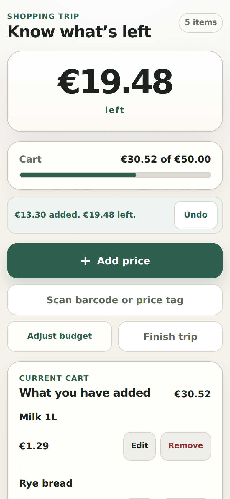
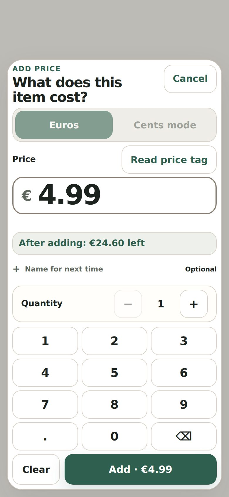
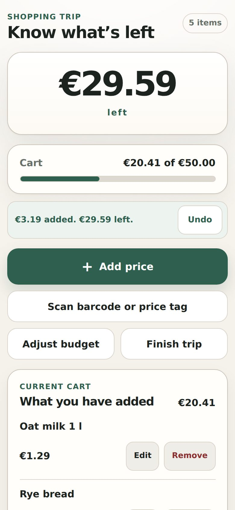
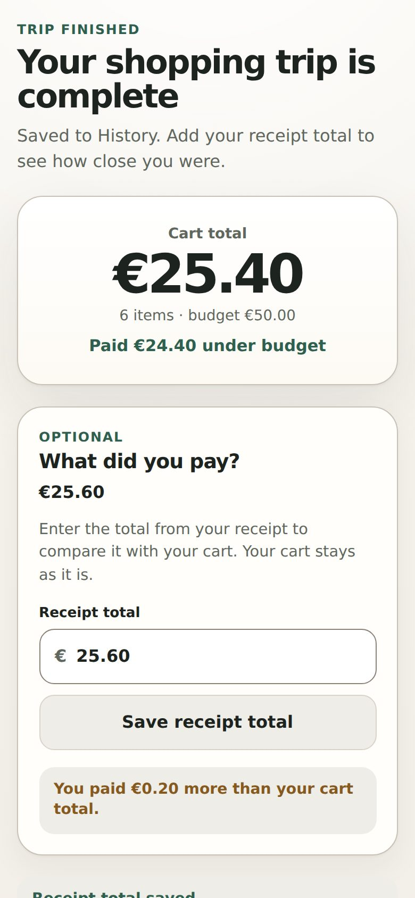

<p align="center">
  
</p>

<h1 align="center">Shopping Budget Companion</h1>

<p align="center"><strong>Know what you can still spend before you reach the checkout.</strong></p>

<p align="center">
  A local-first shopping budget PWA for one job: keep your <strong>safe remaining spend</strong> visible while the basket is still changeable.
</p>

<p align="center">
  <code>No account</code> · <code>No bank connection</code> · <code>Offline core flow</code> · <code>On-device camera processing</code>
</p>

<p align="center">
  <a href="https://mykoladotsenko.github.io/shopping-budget-companion/"><strong>Open the app →</strong></a>
  ·
  <a href="https://mykoladotsenko.github.io/shopping-budget-companion/downloads/shopping-budget-companion-android-preview.apk"><strong>Download Android APK ↓</strong></a>
  ·
  <a href="https://mykoladotsenko.github.io/shopping-budget-companion/privacy/">Privacy</a>
  ·
  <a href="https://github.com/MykolaDotsenko/shopping-budget-companion/issues/new?template=feedback.yml">Send feedback</a>
</p>

<p align="center">
  
</p>

## The decision that matters

The useful number in a supermarket is often not **how much you have spent**. It is:

> **How much can I still safely put in the basket?**

```text
€50.00 limit − €5.00 safety buffer − €32.40 cart = €12.60 safe remaining
```

Shopping Budget Companion keeps **€12.60 left** in front of you instead of making you repeat the arithmetic while you shop.

## 30-second product story

<table>
  <tr>
    <td width="33%">
      
    </td>
    <td width="33%">
      
    </td>
    <td width="33%">
      
    </td>
  </tr>
  <tr>
    <td align="center"><strong>1. Set the limit</strong></td>
    <td align="center"><strong>2. Shop against it</strong></td>
    <td align="center"><strong>3. Check the receipt</strong></td>
  </tr>
</table>

```text
set a limit → add prices → see what remains → correct mistakes → finish → compare with receipt
```

A price is enough to add an item; names are optional. Edit, remove and Undo handle distracted input. At checkout, the actual receipt can be compared with the aisle estimate without rewriting it.

Repeat trips get faster through **Shop again**, **Recent Items** and local **Price Memory**.

## Why this is different

This is purpose-built for the moment **before payment**, when the decision can still change.

| Alternative | Useful for | Gap for this job |
| --- | --- | --- |
| **Calculator** | quick arithmetic | no persistent trip, correction, history or receipt reconciliation |
| **Notes app** | flexible lists | arithmetic and remaining state stay manual |
| **Typical banking/budget app** | account-level spending overview | usually explains spending after transactions, not one basket before checkout |
| **Shopping Budget Companion** | pre-checkout shopping control | intentionally focused on one trip and one remaining amount |

It competes on **remaining-first control, low interaction cost, exact money, local durability and repeat-trip speed** — not feature count. Best-fit situations include fixed grocery limits, cash-envelope/gift-card shopping and larger baskets.

## Built for a real shopping aisle

- **Remaining first** — safe remaining spend is the primary active-trip number.
- **Price first** — names, barcodes and other context stay optional.
- **Correction is cheap** — edit, remove and Undo are normal parts of the flow.
- **No setup wall** — no account, bank link or mandatory onboarding before first value.
- **Offline, repeatable core** — the PWA keeps the budget loop available after initial load, while prior trips and remembered prices reduce repeated work.

## Trust is part of the product

### Money is a domain rule, not a formatting detail

Canonical money is stored as **integer euro cents**.

```text
€3.29 → 329
€12.60 → 1260
€50.00 → 5000
```

Totals, buffers, projections and over-budget states are derived from exact values outside React components.

### Checkout is reconciliation, not a reset

If the estimated cart is **€32.40** and the receipt is **€33.05**, the app reports **€0.65 more than the estimate**. It does not silently rewrite the prices entered during the trip.

### Storage failure must not become silent data loss

Stored state is versioned and Zod-validated. If completion cannot be saved safely, the active trip stays open instead of pretending it was archived.

### Smart capture can suggest; the shopper decides

Manual entry always works. Barcode, product-recognition and shelf-price helpers stay behind an explicit trust boundary:

```text
camera → candidate/context → shopper confirms → canonical price
```

Barcode identity is not treated as a current shelf price; OCR and visual recognition remain advisory, and camera frames stay on-device.

## Engineering underneath

```text
features ─────────▶ application ─────────▶ domain
                         ▲                    ▲
        implements ports │                    │ uses
                         └── infrastructure ──┘
```

| Layer | Responsibility |
| --- | --- |
| **Domain** | exact money, trip rules, projections, product-code rules |
| **Application** | use cases, Undo, lifecycle, recovery, persistence ordering |
| **Infrastructure** | storage, validation/codecs, camera and recognition adapters |
| **UI** | rendering, drafts, focus, accessibility and interaction feedback |

A small TypeScript controller with `useSyncExternalStore` protects money, lifecycle and recovery rules without adding a state framework.

**Product:** React 19 · TypeScript 6 strict · Vite 8 · Zod 4 · CSS Modules · Workbox/PWA · ZXing WASM · Transformers.js/CLIP · Tesseract.js

**Verification:** Vitest · React Testing Library · fast-check · Playwright · axe-core · ESLint · GitHub Actions · dependency/security checks

Browser journeys cover Chromium, Firefox and WebKit across accessibility, recovery, localization, multi-tab and camera-tool flows.

[](https://github.com/MykolaDotsenko/shopping-budget-companion/actions/workflows/quality.yml)

> **Evidence over hype:** automated checks are kept separate from human/device validation. Real-store camera evidence and real-shopper retention remain explicit validation gates, not marketing claims.

## Android APK

**[Download the latest Android preview APK ↓](https://mykoladotsenko.github.io/shopping-budget-companion/downloads/shopping-budget-companion-android-preview.apk)**

The same local-first product is packaged for Android in a thin API 36 wrapper. The web payload is bundled inside the APK and served through Android's secure `WebViewAssetLoader` boundary — no second implementation of money or shopping state.

The linked APK is the **debug-signed preview build from the latest verified `main` deployment**. Its checksum and build metadata are published beside it:

- [SHA-256 checksum](https://mykoladotsenko.github.io/shopping-budget-companion/downloads/shopping-budget-companion-android-preview.apk.sha256)
- [Android build manifest](https://mykoladotsenko.github.io/shopping-budget-companion/downloads/android-build-manifest.json)

Every Quality run also produces the exact **unsigned release APK** that the release workflow later signs with the private production key without rebuilding product code. The signing key is never stored in git.

## Run locally

Requirements: Node.js 24 and npm 11.

```bash
git clone https://github.com/MykolaDotsenko/shopping-budget-companion.git
cd shopping-budget-companion
npm ci
npm run dev
```

Full checks:

```bash
npm run check
npm run test:e2e
```

## Deeper documentation

[Product](./docs/PRODUCT.md) ·
[Architecture](./docs/ARCHITECTURE.md) ·
[Domain](./docs/DOMAIN.md) ·
[Design](./docs/DESIGN.md) ·
[Testing](./docs/TESTING.md) ·
[Data persistence](./docs/architecture/DATA-PERSISTENCE.md) ·
[Decision log](./docs/DECISIONS.md) ·
[Security](./SECURITY.md)

## License

MIT — see [LICENSE](./LICENSE).
